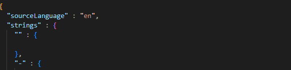
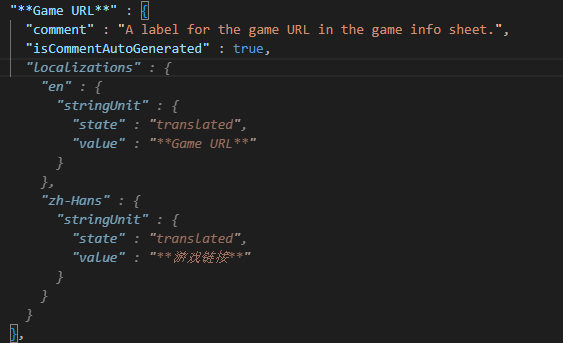

# xcstrings in Vscode

Added xcstring highlight and auto-fill support for xcode.
This is the alpha version and idk if I will continue to maintain it.

## Features

Added highlight so that the structure is clear when you edit.

Also, inline suggestions are also available for xcstring so that translation without Xcode is better.

This photo is a demo using MeloNX repo

---

**Warn**

It still requires modifying project.pbxproj to support your desired language. Trying search "knownRegions" to get it done! 
