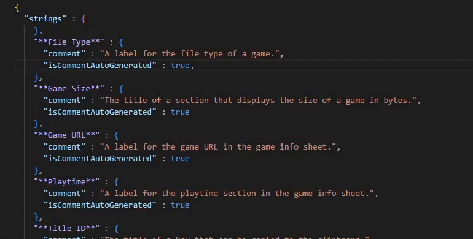
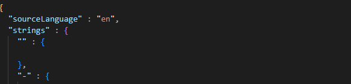
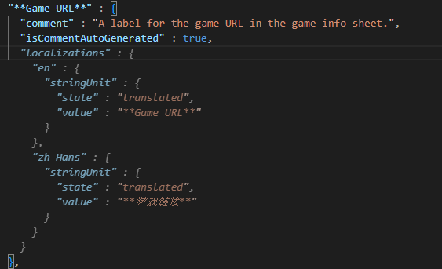

# xcstrings in Vscode

Added xcstring highlight and auto-fill support for xcode.
This is the alpha version and idk if I will continue to maintain it.

## Features

The new look and auto completion is available! Check this gif to know how to use!

Added highlight so that the structure is clear when you edit.

Also, inline suggestions are also available for xcstring so that translation without Xcode is better.

This photo is a demo using MeloNX repo

---

**Warn**

It still requires modifying project.pbxproj to add your desired language to xcode project. Trying search "knownRegions" to get it done! 

**Changelog**

***v0.0.2***
-- Changed to a better clearer color as I thought
-- Added auto completion but not trigger when started with marks

***v0.0.1***
-- Added the project